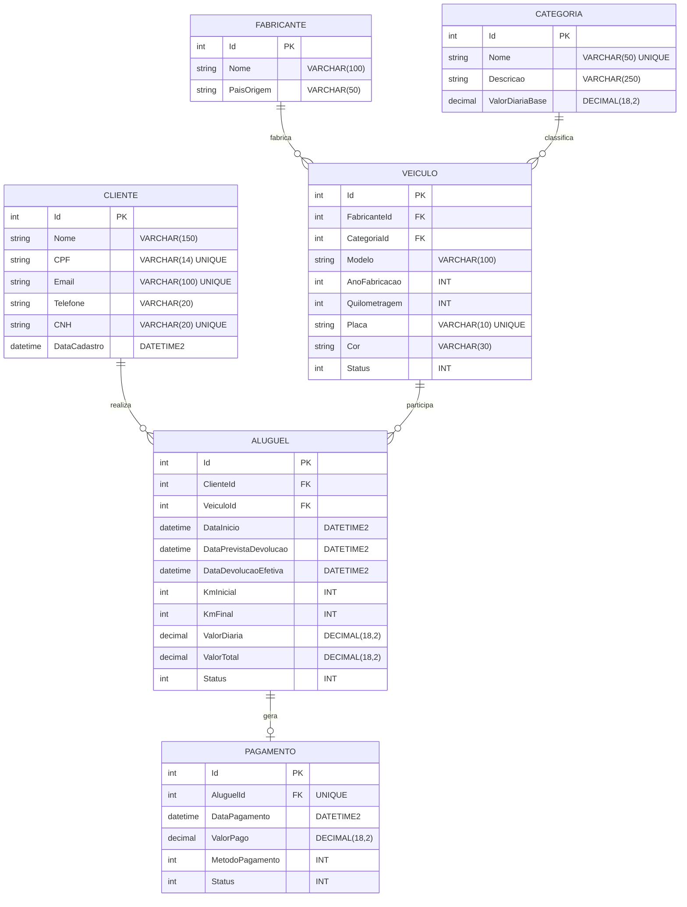

# Modelo Conceitual e Especificação do Banco de Dados
## Sistema de Locadora de Veículos

---

### 1. Introdução

Este documento descreve a modelagem conceitual e relacional do banco de dados para o sistema de gerenciamento de locação de veículos. O modelo foi projetado para atender aos processos de negócio de controle de frota, fabricantes, clientes, contratos de locação e controle financeiro de pagamentos.

O mapeamento objeto-relacional é implementado em C# com Entity Framework Core, utilizando o Microsoft SQL Server como Sistema de Gerenciamento de Banco de Dados (SGBD).

---

### 2. Entidades do Sistema

1. **Fabricante**: Cadastro dos fabricantes e montadoras dos veículos da frota (ex.: Toyota, Volkswagen, Chevrolet, Fiat).
2. **Categoria**: Classificação dos veículos (ex.: Econômico, Sedan Médio, SUV, Premium) e definição do valor base da diária de locação.
3. **Veiculo**: Cadastro dos veículos pertencentes à frota, contendo modelo, ano de fabricação, quilometragem, placa, cor, status e os relacionamentos com Fabricante e Categoria.
4. **Cliente**: Dados cadastrais dos locatários, contendo nome, CPF, e-mail, telefone, número da CNH e data de cadastro.
5. **Aluguel**: Contrato de locação vinculando cliente e veículo por um período, registrando datas de retirada e devolução (prevista e efetiva), quilometragem inicial e final, valor da diária, valor total e status do aluguel.
6. **Pagamento**: Registro da liquidação financeira do aluguel, contendo data do pagamento, valor pago, forma de pagamento e status da transação.

---

### 3. Diagrama Entidade-Relacionamento (DER)

---

### 4. Esquema Relacional

- **Fabricantes** (<ins>Id</ins>, Nome, PaisOrigem)
- **Categorias** (<ins>Id</ins>, Nome, Descricao, ValorDiariaBase)
- **Veiculos** (<ins>Id</ins>, Modelo, AnoFabricacao, Quilometragem, Placa, Cor, Status, *FabricanteId*, *CategoriaId*)
  - *FabricanteId* referencia Fabricantes(Id)
  - *CategoriaId* referencia Categorias(Id)
- **Clientes** (<ins>Id</ins>, Nome, CPF, Email, Telefone, CNH, DataCadastro)
- **Alugueis** (<ins>Id</ins>, DataInicio, DataPrevistaDevolucao, DataDevolucaoEfetiva, KmInicial, KmFinal, ValorDiaria, ValorTotal, Status, *ClienteId*, *VeiculoId*)
  - *ClienteId* referencia Clientes(Id)
  - *VeiculoId* referencia Veiculos(Id)
- **Pagamentos** (<ins>Id</ins>, DataPagamento, ValorPago, MetodoPagamento, Status, *AluguelId*)
  - *AluguelId* referencia Alugueis(Id)

---

### 5. Dicionário de Dados

#### Tabela: Fabricantes
| Coluna | Tipo C# | Tipo SQL | Nulo | Restrição | Descrição |
| :--- | :--- | :--- | :--- | :--- | :--- |
| `Id` | `int` | `int` | Não | PK, Identity | Identificador único |
| `Nome` | `string` | `nvarchar(100)` | Não | - | Nome da marca |
| `PaisOrigem` | `string` | `nvarchar(50)` | Não | - | País de origem da marca |

#### Tabela: Categorias
| Coluna | Tipo C# | Tipo SQL | Nulo | Restrição | Descrição |
| :--- | :--- | :--- | :--- | :--- | :--- |
| `Id` | `int` | `int` | Não | PK, Identity | Identificador único |
| `Nome` | `string` | `nvarchar(50)` | Não | UNIQUE | Nome da categoria |
| `Descricao` | `string` | `nvarchar(250)` | Sim | - | Descrição da categoria |
| `ValorDiariaBase` | `decimal` | `decimal(18,2)` | Não | - | Valor base da diária |

#### Tabela: Veiculos
| Coluna | Tipo C# | Tipo SQL | Nulo | Restrição | Descrição |
| :--- | :--- | :--- | :--- | :--- | :--- |
| `Id` | `int` | `int` | Não | PK, Identity | Identificador único |
| `Modelo` | `string` | `nvarchar(100)` | Não | - | Modelo do veículo |
| `AnoFabricacao` | `int` | `int` | Não | - | Ano de fabricação |
| `Quilometragem` | `int` | `int` | Não | - | Quilometragem atual |
| `Placa` | `string` | `nvarchar(10)` | Não | UNIQUE | Placa do veículo |
| `Cor` | `string` | `nvarchar(30)` | Não | - | Cor do veículo |
| `Status` | `StatusVeiculo` | `int` | Não | Enum | 1=Disponível, 2=Alugado, 3=EmManutenção, 4=Inativo |
| `FabricanteId` | `int` | `int` | Não | FK | Chave estrangeira de Fabricantes |
| `CategoriaId` | `int` | `int` | Não | FK | Chave estrangeira de Categorias |

#### Tabela: Clientes
| Coluna | Tipo C# | Tipo SQL | Nulo | Restrição | Descrição |
| :--- | :--- | :--- | :--- | :--- | :--- |
| `Id` | `int` | `int` | Não | PK, Identity | Identificador único |
| `Nome` | `string` | `nvarchar(150)` | Não | - | Nome completo |
| `CPF` | `string` | `nvarchar(14)` | Não | UNIQUE | CPF do cliente |
| `Email` | `string` | `nvarchar(100)` | Não | UNIQUE | E-mail de contato |
| `Telefone` | `string` | `nvarchar(20)` | Não | - | Telefone |
| `CNH` | `string` | `nvarchar(20)` | Não | UNIQUE | Número da CNH |
| `DataCadastro` | `DateTime` | `datetime2` | Não | - | Data de cadastro |

#### Tabela: Alugueis
| Coluna | Tipo C# | Tipo SQL | Nulo | Restrição | Descrição |
| :--- | :--- | :--- | :--- | :--- | :--- |
| `Id` | `int` | `int` | Não | PK, Identity | Identificador único |
| `ClienteId` | `int` | `int` | Não | FK | Chave estrangeira de Clientes |
| `VeiculoId` | `int` | `int` | Não | FK | Chave estrangeira de Veiculos |
| `DataInicio` | `DateTime` | `datetime2` | Não | - | Início da locação |
| `DataPrevistaDevolucao` | `DateTime` | `datetime2` | Não | - | Data prevista de devolução |
| `DataDevolucaoEfetiva` | `DateTime?` | `datetime2` | Sim | - | Data efetiva de devolução |
| `KmInicial` | `int` | `int` | Não | - | Quilometragem na retirada |
| `KmFinal` | `int?` | `int` | Sim | - | Quilometragem na devolução |
| `ValorDiaria` | `decimal` | `decimal(18,2)` | Não | - | Valor da diária contratada |
| `ValorTotal` | `decimal` | `decimal(18,2)` | Não | - | Valor total da locação |
| `Status` | `StatusAluguel` | `int` | Não | Enum | 1=Ativo, 2=Concluído, 3=Cancelado |

#### Tabela: Pagamentos
| Coluna | Tipo C# | Tipo SQL | Nulo | Restrição | Descrição |
| :--- | :--- | :--- | :--- | :--- | :--- |
| `Id` | `int` | `int` | Não | PK, Identity | Identificador único |
| `AluguelId` | `int` | `int` | Não | FK, UNIQUE | Chave estrangeira de Alugueis |
| `DataPagamento` | `DateTime` | `datetime2` | Não | - | Data do pagamento |
| `ValorPago` | `decimal` | `decimal(18,2)` | Não | - | Valor pago |
| `MetodoPagamento` | `MetodoPagamento` | `int` | Não | Enum | 1=Cartão de Crédito, 2=Débito, 3=PIX, 4=Dinheiro, 5=Boleto |
| `Status` | `StatusPagamento` | `int` | Não | Enum | 1=Pendente, 2=Pago, 3=Cancelado |

---

### 6. Integridade de Dados

- **Chaves Primárias**: Todas as tabelas possuem chave primária simples auto-incremental (`IDENTITY`).
- **Unicidade**: Restrições de unicidade aplicadas em CPF, E-mail, CNH, Placa e Nome da Categoria.
- **Integridade Referencial**: Relações configuradas com `DeleteBehavior.Restrict` para evitar exclusões em cascata indesejadas em entidades fundamentais, mantendo o histórico de locações.
- **Tipos Decimais**: Campos de moeda utilizam `decimal(18,2)` para precisão contábil.
- **Script SQL**: O script DDL completo está disponível no arquivo `docs/script_banco_sql_express.sql`.
