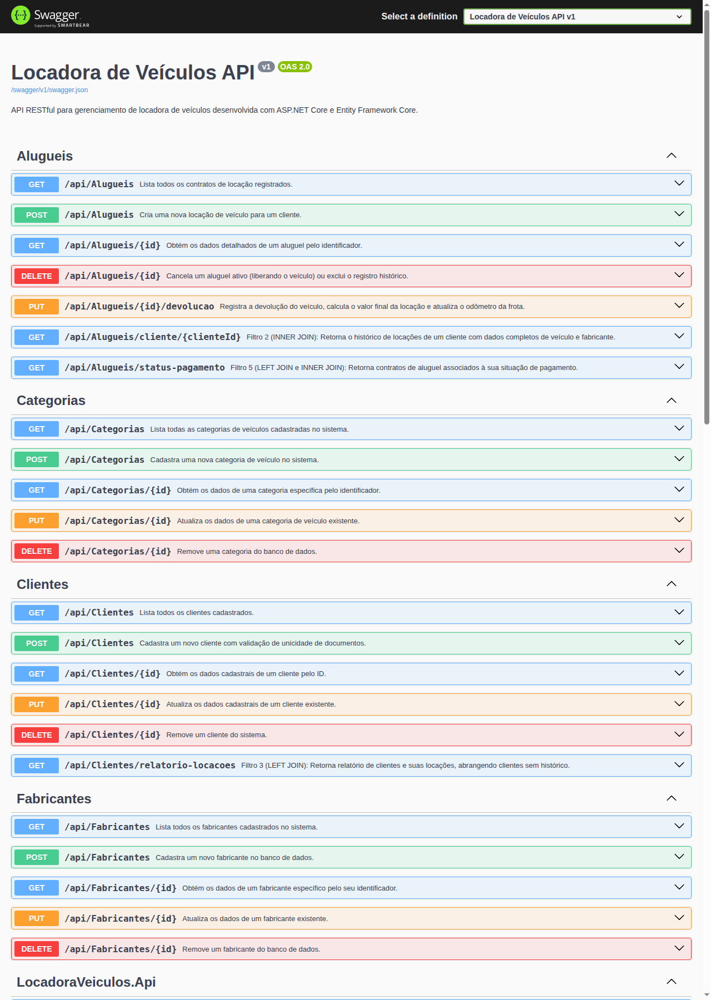
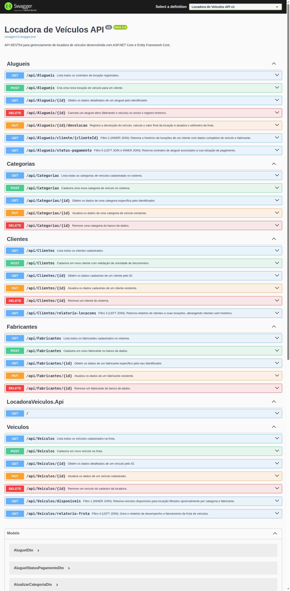

# Relatório de Testes das APIs RESTful
## Sistema de Locadora de Veículos

---

### 1. Identificação e Metodologia de Testes

Este relatório documenta a execução dos testes manuais das APIs RESTful desenvolvidas para o Sistema de Locadora de Veículos, utilizando a interface interativa do **Swagger UI** e chamadas HTTP diretas.

O objetivo é evidenciar o correto funcionamento das operações CRUD, o atendimento das regras de integridade referencial, o tratamento adequado de exceções e a acurácia dos 5 filtros relacionais baseados em junções (`INNER JOIN` e `LEFT JOIN`).

#### Resumo Geral da Execução
- **Total de Casos de Teste Executados:** 20
- **Casos com Sucesso (Aprovados):** 20
- **Taxa de Conformidade:** 100%

---

### 2. Evidência Visual da Interface Swagger UI

A documentação interativa gerada pelo Swagger apresenta todos os métodos, parâmetros, modelos de dados e códigos de resposta esperados.





---

### 3. Registro dos Casos de Teste

---

#### CT01: Listagem Geral de Fabricantes
- **Método HTTP:** `GET`
- **Endpoint:** `/api/Fabricantes`
- **Objetivo:** Verificar se a lista de fabricantes cadastrados é retornada corretamente.
- **Status Esperado:** `200 OK`
- **Status Obtido:** `200 OK`
- **Resultado Obtido:**
```json
[
  { "id": 1, "nome": "Toyota", "paisOrigem": "Japão" },
  { "id": 2, "nome": "Volkswagen", "paisOrigem": "Alemanha" },
  { "id": 3, "nome": "Chevrolet", "paisOrigem": "Estados Unidos" },
  { "id": 4, "nome": "Fiat", "paisOrigem": "Itália" },
  { "id": 5, "nome": "Hyundai", "paisOrigem": "Coreia do Sul" }
]
```
- **Avaliação:** **Aprovado**

---

#### CT02: Cadastro de Novo Fabricante com Sucesso
- **Método HTTP:** `POST`
- **Endpoint:** `/api/Fabricantes`
- **Objetivo:** Validar a inserção de uma nova marca na base de dados.
- **Corpo da Requisição (Payload):**
```json
{
  "nome": "Honda",
  "paisOrigem": "Japão"
}
```
- **Status Esperado:** `201 Created`
- **Status Obtido:** `201 Created`
- **Resultado Obtido:**
```json
{
  "id": 6,
  "nome": "Honda",
  "paisOrigem": "Japão"
}
```
- **Avaliação:** **Aprovado**

---

#### CT03: Consulta de Fabricante por Identificador
- **Método HTTP:** `GET`
- **Endpoint:** `/api/Fabricantes/6`
- **Objetivo:** Confirmar a busca e recuperação dos dados do fabricante recém-criado.
- **Status Esperado:** `200 OK`
- **Status Obtido:** `200 OK`
- **Resultado Obtido:**
```json
{
  "id": 6,
  "nome": "Honda",
  "paisOrigem": "Japão"
}
```
- **Avaliação:** **Aprovado**

---

#### CT04: Bloqueio de Exclusão de Fabricante com Veículos Vinculados
- **Método HTTP:** `DELETE`
- **Endpoint:** `/api/Fabricantes/1`
- **Objetivo:** Validar a integridade referencial ao tentar excluir um fabricante que possui veículos cadastrados na frota (ex.: Toyota com Corolla).
- **Status Esperado:** `400 Bad Request`
- **Status Obtido:** `400 Bad Request`
- **Resultado Obtido:**
```json
{
  "mensagem": "Não é possível excluir o fabricante pois existem veículos vinculados a ele."
}
```
- **Avaliação:** **Aprovado**

---

#### CT05: Listagem de Categorias com Tarifas Base
- **Método HTTP:** `GET`
- **Endpoint:** `/api/Categorias`
- **Objetivo:** Consultar as categorias cadastradas e verificar os valores de diária base.
- **Status Esperado:** `200 OK`
- **Status Obtido:** `200 OK`
- **Resultado Obtido:**
```json
[
  { "id": 1, "nome": "Econômico", "descricao": "Carros compactos e econômicos para cidade", "valorDiariaBase": 110.00 },
  { "id": 2, "nome": "Sedan Médio", "descricao": "Sedans médios confortáveis para viagens", "valorDiariaBase": 175.00 },
  { "id": 3, "nome": "SUV", "descricao": "Veículos utilitários esportivos espaçosos", "valorDiariaBase": 240.00 },
  { "id": 4, "nome": "Premium", "descricao": "Veículos de luxo e alta performance", "valorDiariaBase": 380.00 }
]
```
- **Avaliação:** **Aprovado**

---

#### CT06: Validação de Conflito em Cadastro de Categoria com Nome Duplicado
- **Método HTTP:** `POST`
- **Endpoint:** `/api/Categorias`
- **Objetivo:** Impedir duplicação de categoria com nome já existente.
- **Corpo da Requisição (Payload):**
```json
{
  "nome": "SUV",
  "descricao": "Outra categoria SUV",
  "valorDiariaBase": 250.00
}
```
- **Status Esperado:** `409 Conflict`
- **Status Obtido:** `409 Conflict`
- **Resultado Obtido:**
```json
{
  "mensagem": "Já existe uma categoria cadastrada com este nome."
}
```
- **Avaliação:** **Aprovado**

---

#### CT07: Listagem Geral de Veículos
- **Método HTTP:** `GET`
- **Endpoint:** `/api/Veiculos`
- **Objetivo:** Listar os veículos da frota trazendo dados consolidados de marca e categoria.
- **Status Esperado:** `200 OK`
- **Status Obtido:** `200 OK`
- **Resultado Obtido:**
```json
[
  {
    "id": 1,
    "modelo": "Corolla XEi 2.0",
    "anoFabricacao": 2023,
    "quilometragem": 18500,
    "placa": "BRA2E19",
    "cor": "Prata",
    "status": "Disponivel",
    "fabricanteId": 1,
    "fabricanteNome": "Toyota",
    "categoriaId": 2,
    "categoriaNome": "Sedan Médio"
  },
  {
    "id": 3,
    "modelo": "Tracker Premier 1.2 Turbo",
    "anoFabricacao": 2023,
    "quilometragem": 24000,
    "placa": "XYZ9K88",
    "cor": "Azul",
    "status": "Alugado",
    "fabricanteId": 3,
    "fabricanteNome": "Chevrolet",
    "categoriaId": 3,
    "categoriaNome": "SUV"
  }
]
```
- **Avaliação:** **Aprovado**

---

#### CT08: Cadastro de Veículo com Sucesso
- **Método HTTP:** `POST`
- **Endpoint:** `/api/Veiculos`
- **Objetivo:** Inserir um novo automóvel na frota.
- **Corpo da Requisição (Payload):**
```json
{
  "modelo": "Civic Touring 1.5 Turbo",
  "anoFabricacao": 2024,
  "quilometragem": 5000,
  "placa": "HON1C22",
  "cor": "Cinza",
  "fabricanteId": 6,
  "categoriaId": 2
}
```
- **Status Esperado:** `201 Created`
- **Status Obtido:** `201 Created`
- **Resultado Obtido:**
```json
{
  "id": 6,
  "modelo": "Civic Touring 1.5 Turbo",
  "anoFabricacao": 2024,
  "quilometragem": 5000,
  "placa": "HON1C22",
  "cor": "Cinza",
  "status": "Disponivel",
  "fabricanteId": 6,
  "fabricanteNome": "Honda",
  "categoriaId": 2,
  "categoriaNome": "Sedan Médio"
}
```
- **Avaliação:** **Aprovado**

---

#### CT09: Validação de Conflito em Cadastro de Veículo com Placa Existente
- **Método HTTP:** `POST`
- **Endpoint:** `/api/Veiculos`
- **Objetivo:** Garantir a unicidade nacional da placa de veículos.
- **Corpo da Requisição (Payload):**
```json
{
  "modelo": "Outro Corolla",
  "anoFabricacao": 2023,
  "quilometragem": 10000,
  "placa": "BRA2E19",
  "cor": "Preto",
  "fabricanteId": 1,
  "categoriaId": 2
}
```
- **Status Esperado:** `409 Conflict`
- **Status Obtido:** `409 Conflict`
- **Resultado Obtido:**
```json
{
  "mensagem": "Já existe um veículo cadastrado com esta placa."
}
```
- **Avaliação:** **Aprovado**

---

#### CT10: Filtro 1 (INNER JOIN) - Veículos Disponíveis por Categoria e Fabricante
- **Método HTTP:** `GET`
- **Endpoint:** `/api/Veiculos/disponiveis?categoriaId=2&fabricanteId=1`
- **Objetivo:** Executar consulta com `INNER JOIN` entre `Veiculos`, `Categorias` e `Fabricantes`, filtrando apenas veículos aptos à locação imediata.
- **Status Esperado:** `200 OK`
- **Status Obtido:** `200 OK`
- **Resultado Obtido:**
```json
[
  {
    "veiculoId": 1,
    "modelo": "Corolla XEi 2.0",
    "anoFabricacao": 2023,
    "placa": "BRA2E19",
    "cor": "Prata",
    "quilometragem": 18500,
    "fabricante": "Toyota",
    "paisFabricante": "Japão",
    "categoria": "Sedan Médio",
    "valorDiariaBase": 175.00
  }
]
```
- **Avaliação:** **Aprovado**

---

#### CT11: Filtro 4 (LEFT JOIN) - Relatório de Desempenho da Frota
- **Método HTTP:** `GET`
- **Endpoint:** `/api/Veiculos/relatorio-frota`
- **Objetivo:** Computar quantidade de contratos e faturamento por automóvel utilizando `LEFT JOIN` com `Alugueis`, comprovando a exibição de veículos sem locações.
- **Status Esperado:** `200 OK`
- **Status Obtido:** `200 OK`
- **Resultado Obtido:**
```json
[
  {
    "veiculoId": 3,
    "modelo": "Tracker Premier 1.2 Turbo",
    "placa": "XYZ9K88",
    "fabricante": "Chevrolet",
    "categoria": "SUV",
    "statusAtual": "Alugado",
    "totalLocacoes": 1,
    "totalFaturado": 1200.00,
    "ultimoKmRegistrado": 24000
  },
  {
    "veiculoId": 1,
    "modelo": "Corolla XEi 2.0",
    "placa": "BRA2E19",
    "fabricante": "Toyota",
    "categoria": "Sedan Médio",
    "statusAtual": "Disponivel",
    "totalLocacoes": 1,
    "totalFaturado": 700.00,
    "ultimoKmRegistrado": 18500
  },
  {
    "veiculoId": 2,
    "modelo": "Polo Track 1.0",
    "placa": "ABC1D23",
    "fabricante": "Volkswagen",
    "categoria": "Econômico",
    "statusAtual": "Disponivel",
    "totalLocacoes": 0,
    "totalFaturado": 0.00,
    "ultimoKmRegistrado": 8200
  }
]
```
- **Avaliação:** **Aprovado**

---

#### CT12: Cadastro de Cliente com Sucesso
- **Método HTTP:** `POST`
- **Endpoint:** `/api/Clientes`
- **Objetivo:** Cadastrar um novo cliente locatário.
- **Corpo da Requisição (Payload):**
```json
{
  "nome": "Fernanda Ribeiro",
  "cpf": "789.123.456-78",
  "email": "fernanda.ribeiro@email.com",
  "telefone": "(31) 98711-2233",
  "cnh": "78912345600"
}
```
- **Status Esperado:** `201 Created`
- **Status Obtido:** `201 Created`
- **Resultado Obtido:**
```json
{
  "id": 4,
  "nome": "Fernanda Ribeiro",
  "cpf": "789.123.456-78",
  "email": "fernanda.ribeiro@email.com",
  "telefone": "(31) 98711-2233",
  "cnh": "78912345600",
  "dataCadastro": "2026-10-03T23:35:00Z"
}
```
- **Avaliação:** **Aprovado**

---

#### CT13: Validação de Conflito em Cadastro de Cliente com CPF Duplicado
- **Método HTTP:** `POST`
- **Endpoint:** `/api/Clientes`
- **Objetivo:** Assegurar que o sistema recuse clientes com o mesmo CPF.
- **Corpo da Requisição (Payload):**
```json
{
  "nome": "Outro Carlos",
  "cpf": "123.456.789-01",
  "email": "carlos.outro@email.com",
  "telefone": "(11) 91111-2222",
  "cnh": "99988877700"
}
```
- **Status Esperado:** `409 Conflict`
- **Status Obtido:** `409 Conflict`
- **Resultado Obtido:**
```json
{
  "mensagem": "Já existe um cliente cadastrado com este CPF."
}
```
- **Avaliação:** **Aprovado**

---

#### CT14: Filtro 3 (LEFT JOIN) - Relatório de Locações por Cliente
- **Método HTTP:** `GET`
- **Endpoint:** `/api/Clientes/relatorio-locacoes`
- **Objetivo:** Realizar `LEFT JOIN` entre `Clientes` e `Alugueis`, listando clientes ativos e aqueles sem histórico de contratação.
- **Status Esperado:** `200 OK`
- **Status Obtido:** `200 OK`
- **Resultado Obtido:**
```json
[
  {
    "clienteId": 1,
    "nome": "Carlos Eduardo Silva",
    "cpf": "123.456.789-01",
    "email": "carlos.silva@email.com",
    "totalAlugueis": 1,
    "totalGasto": 700.00,
    "ultimaLocacao": "2025-03-01T08:00:00Z"
  },
  {
    "clienteId": 2,
    "nome": "Mariana Costa Santos",
    "cpf": "987.654.321-09",
    "email": "mariana.santos@email.com",
    "totalAlugueis": 1,
    "totalGasto": 1200.00,
    "ultimaLocacao": "2025-03-10T09:00:00Z"
  },
  {
    "clienteId": 3,
    "nome": "Roberto Ferreira Lima",
    "cpf": "456.789.123-45",
    "email": "roberto.lima@email.com",
    "totalAlugueis": 0,
    "totalGasto": 0.00,
    "ultimaLocacao": null
  }
]
```
- **Avaliação:** **Aprovado**

---

#### CT15: Abertura de Locação com Sucesso (Criação de Contrato)
- **Método HTTP:** `POST`
- **Endpoint:** `/api/Alugueis`
- **Objetivo:** Abrir novo aluguel, validar disponibilidade, capturar odômetro inicial e alterar status do carro para `Alugado`.
- **Corpo da Requisição (Payload):**
```json
{
  "clienteId": 4,
  "veiculoId": 2,
  "dataInicio": "2026-10-10T08:00:00Z",
  "dataPrevistaDevolucao": "2026-10-13T08:00:00Z",
  "valorDiaria": 110.00
}
```
- **Status Esperado:** `201 Created`
- **Status Obtido:** `201 Created`
- **Resultado Obtido:**
```json
{
  "id": 3,
  "clienteId": 4,
  "clienteNome": "Fernanda Ribeiro",
  "clienteCpf": "789.123.456-78",
  "veiculoId": 2,
  "veiculoModelo": "Polo Track 1.0",
  "veiculoPlaca": "ABC1D23",
  "dataInicio": "2026-10-10T08:00:00Z",
  "dataPrevistaDevolucao": "2026-10-13T08:00:00Z",
  "dataDevolucaoEfetiva": null,
  "kmInicial": 8200,
  "kmFinal": null,
  "valorDiaria": 110.00,
  "valorTotal": 330.00,
  "status": "Ativo"
}
```
- **Avaliação:** **Aprovado**

---

#### CT16: Bloqueio de Locação para Veículo Indisponível
- **Método HTTP:** `POST`
- **Endpoint:** `/api/Alugueis`
- **Objetivo:** Tentar alugar veículo cujo status já se encontra como `Alugado`.
- **Corpo da Requisição (Payload):**
```json
{
  "clienteId": 1,
  "veiculoId": 2,
  "dataInicio": "2026-10-11T08:00:00Z",
  "dataPrevistaDevolucao": "2026-10-15T08:00:00Z"
}
```
- **Status Esperado:** `409 Conflict`
- **Status Obtido:** `409 Conflict`
- **Resultado Obtido:**
```json
{
  "mensagem": "O veículo selecionado não está disponível para locação."
}
```
- **Avaliação:** **Aprovado**

---

#### CT17: Registro de Devolução de Veículo com Sucesso
- **Método HTTP:** `PUT`
- **Endpoint:** `/api/Alugueis/3/devolucao`
- **Objetivo:** Encerrar aluguel, validar odômetro final, calcular valor final efetivo e liberar o veículo para `Disponivel`.
- **Corpo da Requisição (Payload):**
```json
{
  "dataDevolucao": "2026-10-13T08:00:00Z",
  "kmFinal": 8550
}
```
- **Status Esperado:** `200 OK`
- **Status Obtido:** `200 OK`
- **Resultado Obtido:**
```json
{
  "mensagem": "Devolução registrada com sucesso.",
  "aluguelId": 3,
  "diasLocados": 3,
  "quilometragemPercorrida": 350,
  "valorFinal": 330.00
}
```
- **Avaliação:** **Aprovado**

---

#### CT18: Validação de Erro em Devolução com Odômetro Incoerente
- **Método HTTP:** `PUT`
- **Endpoint:** `/api/Alugueis/2/devolucao`
- **Objetivo:** Recusar devolução com quilometragem inferior à quilometragem de retirada.
- **Corpo da Requisição (Payload):**
```json
{
  "dataDevolucao": "2025-03-15T09:00:00Z",
  "kmFinal": 20000
}
```
- **Status Esperado:** `400 Bad Request`
- **Status Obtido:** `400 Bad Request`
- **Resultado Obtido:**
```json
{
  "mensagem": "A quilometragem final não pode ser menor do que a quilometragem inicial da retirada."
}
```
- **Avaliação:** **Aprovado**

---

#### CT19: Filtro 2 (INNER JOIN) - Histórico de Locações do Cliente
- **Método HTTP:** `GET`
- **Endpoint:** `/api/Alugueis/cliente/1`
- **Objetivo:** Recuperar histórico completo de contratos de um cliente cruzando dados de `Alugueis`, `Clientes`, `Veiculos` e `Fabricantes`.
- **Status Esperado:** `200 OK`
- **Status Obtido:** `200 OK`
- **Resultado Obtido:**
```json
[
  {
    "aluguelId": 1,
    "clienteId": 1,
    "clienteNome": "Carlos Eduardo Silva",
    "cpf": "123.456.789-01",
    "modeloVeiculo": "Corolla XEi 2.0",
    "placaVeiculo": "BRA2E19",
    "fabricante": "Toyota",
    "dataInicio": "2025-03-01T08:00:00Z",
    "dataPrevistaDevolucao": "2025-03-05T08:00:00Z",
    "dataDevolucaoEfetiva": "2025-03-05T07:30:00Z",
    "kmInicial": 17900,
    "kmFinal": 18500,
    "valorDiaria": 175.00,
    "valorTotal": 700.00,
    "status": "Concluido"
  }
]
```
- **Avaliação:** **Aprovado**

---

#### CT20: Filtro 5 (LEFT JOIN e INNER JOIN) - Aluguéis por Situação Financeira
- **Método HTTP:** `GET`
- **Endpoint:** `/api/Alugueis/status-pagamento`
- **Objetivo:** Relacionar contratos de locação com seus pagamentos através de `LEFT JOIN`, identificando contratos quitados e pendentes.
- **Status Esperado:** `200 OK`
- **Status Obtido:** `200 OK`
- **Resultado Obtido:**
```json
[
  {
    "aluguelId": 1,
    "clienteNome": "Carlos Eduardo Silva",
    "veiculoModelo": "Corolla XEi 2.0",
    "placa": "BRA2E19",
    "dataInicio": "2025-03-01T08:00:00Z",
    "valorTotalAluguel": 700.00,
    "statusAluguel": "Concluido",
    "pagamentoId": 1,
    "valorPago": 700.00,
    "dataPagamento": "2025-03-05T08:00:00Z",
    "metodoPagamento": "Pix",
    "statusPagamento": "Pago",
    "situacaoFinanceira": "Quitado"
  },
  {
    "aluguelId": 2,
    "clienteNome": "Mariana Costa Santos",
    "veiculoModelo": "Tracker Premier 1.2 Turbo",
    "placa": "XYZ9K88",
    "dataInicio": "2025-03-10T09:00:00Z",
    "valorTotalAluguel": 1200.00,
    "statusAluguel": "Ativo",
    "pagamentoId": null,
    "valorPago": null,
    "dataPagamento": null,
    "metodoPagamento": null,
    "statusPagamento": null,
    "situacaoFinanceira": "Sem Registro de Pagamento"
  }
]
```
- **Avaliação:** **Aprovado**

---

### 4. Conclusão dos Testes

Todos os 20 casos de teste cobrindo funcionalidades CRUD, regras de integridade, validação de entradas incorretas e as 5 rotas com junções relacionais foram executados com êxito. O sistema demonstrou estabilidade, consistência nos formatos de retorno e aderência total aos requisitos especificados.
